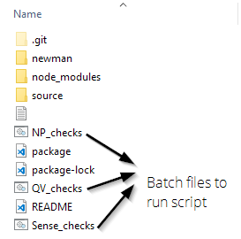
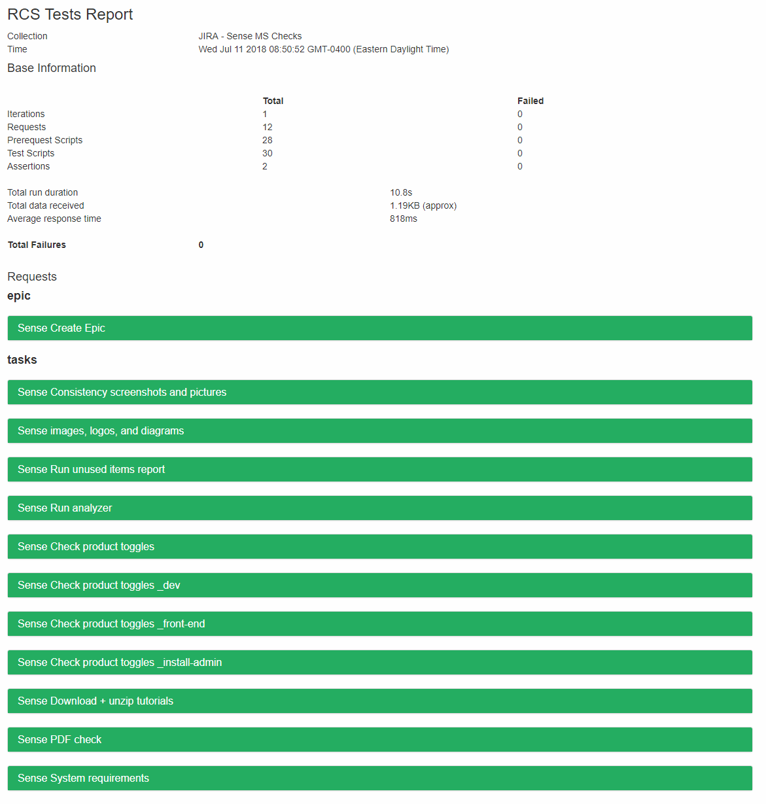

# JIRA-postman

<div style="display:flex;flex-direction:row;justify-content:center"  >

<h2 style="padding:25px"> & </h2>

</div>

## Description

A script to build JIRA tasks using postman collections and Newman.

## Note about passwords

Your JIRA password is stored to the postman environment file `MS_env.json`, but I have removed this file from the git index. After you run the script, your local MS_env file is populated with the variables that you enter when prompted. Git ignores changes to this file, but you should still be careful with which files you share.

## Installation

### Requirements

You'll need to have `npm` to install dependencies.

Download [here](https://www.npmjs.com/get-npm).

Clone the repo.

```bash
c/git
$ git clone https://github.com/kyleweishaar/JIRA-postman
```

From the root folder, run the following command to install the dependencies:

```bash
npm install
```

### Folder structure

You can ignore most of what's in here. Click on one of the batch files to run the script.



## Usage

To run the script, double-click the batch file:

1. `NP_checks` for NPrinting.

1. `Sense_checks` for Sense.

1. `QV_checks` for QlikView.

The batch file opens a cmd shell. Enter the details as prompted.

- trigram = Qlik trigram

- password = JIRA/Qlik password

- JIRA label = product_MS_Checks

- epic title = product MS Checks

- epic desc = This is the description field in the JIRA task.

- due date = Can be any date. It is added before the description of each task.

### The report

After the program runs, you'll get a confirmation message and a status report opens in your browser.



Click the first green bar at the top of the page to expand it. In the reponse body you'll see the epic JIRA number. All JIRA tasks are nested under that. If there are errors, the bar(s) appear red. Expand the bar to see the error code and use Google to search for JIRA error code values.

Reports are saved to the `Newman` folder. The newman folder is in the gitignore file so new reports won't be added to github.